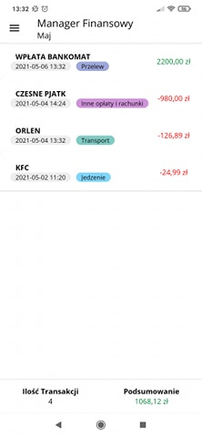
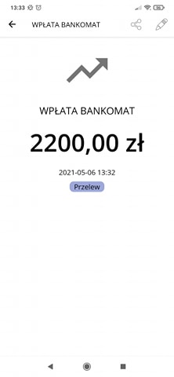
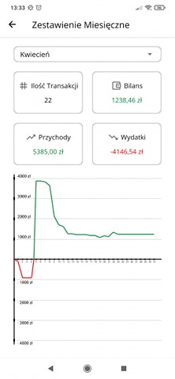

# Finance Manager
>Finance Manager is a Mobile Android Application for managing your finances.

## Table of contents
* [General Info](#general-info)
* [Download](#download)
* [Features](#features)
* [Technologies](#technologies)
* [Screenshots](#screenshots)
* [Status](#status)
* [Contact](#contact)
* [License](#license)

## General Info
>This Application was created as a project for IT studies in the Mobile Programming subject. 
>For now it only supports polish language and currency.

## Download

## Features
List of features ready and TODOs for future development
* Add, edit, delete your incomes and expenses
* Set custom name and date for each income / expense
* Set predefined category for your income / expense (food, transport, health etc.)
* Sort by incomes or expenses only
* Search by name, category or date
* Share your income / expense as text message (by sms, messenger, mail)
* Monthly statistics of your finances with a colorful chart

Todo list:
* Support for English language
* Add different currencies

## Technologies
* Java
* SQLite

## Screenshots
<kbd></kbd>
<kbd></kbd>
<kbd></kbd>

## Status
Project is: _in progress_

## Contact
Created by [Piotr Wasilewski](mailto:wasilewski.piotr0@gmail.com) - feel free to contact me via email!

## License
[MIT](https://choosealicense.com/licenses/mit/)
